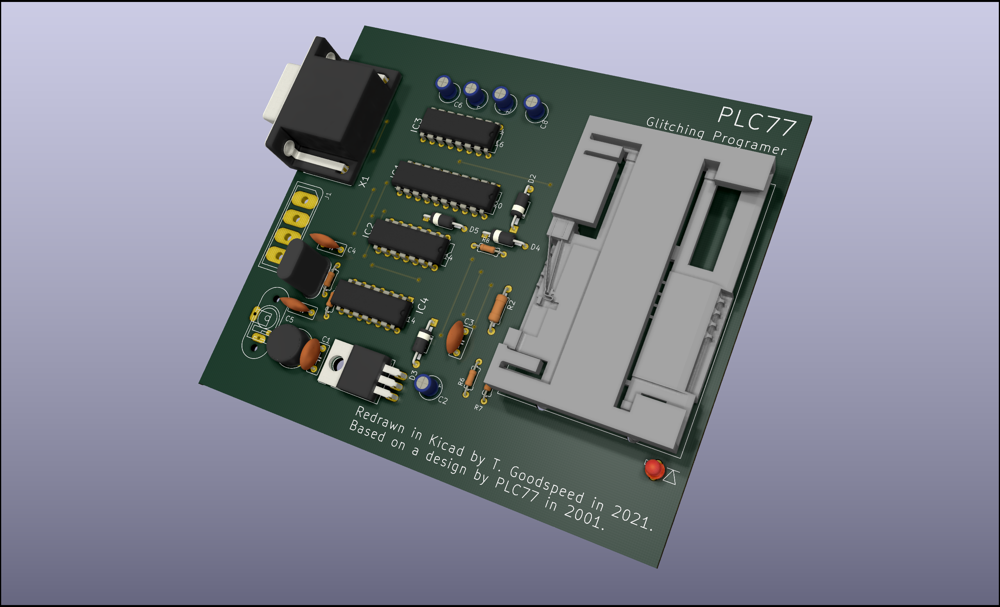

Howdy y'all,

As I write this in 2021, glitching is all the rage in hardware
security again, but twenty years ago in the satellite TV cracking
community it was just as popular, with hand-etched PCBs of
through-hole components being used to glitch smart cards and freely
watch TV.

As Tripod begins to bitrot and this history slowly becomes lost to us,
I thought I'd grab an old glitcher from a [Tripod
website](http://dark-agent_drdss.tripod.com/drdss/id7.html), convert
it to Kicad, and maybe assemble a few glitchers from that age.  This
one is by LPC77, dating from April of 2001.

--Travis



## Organization

The root directory is a [Kicad](https://www.kicad.org/) project,
restored from the original design but without modernizations such as
surface-mount componenets that would alter its asthetics.

The `past` directory contains the published source files, originally
in Eagle's old binary format.  I used Eagle 6.6.0 under Wine to
convert the files into the modern XML format, which Kicad can freely
import.

## Original README Follows

Revisons:
I have increased the length of the circuit board by 1/2 inch 
to allow for a less cluttered layout.

I moved the surface mount resistors nearer to the thru hole types.

I also (the Most Significant change) modified the oscilator circuit
to add a resistor(R6) and change the value of R1, making the output
wave form much better.

Parts list and Notes

```
1 ISO card socket of your choosing
1 9 pin female D sum min connector (X2)
2 1n4004 diodes (D2, D3)
2 1n914 or 1n4148 diodes (D4, D5)
1 red/dreen led (two lead type) (D1)
1 90S2313p-10 atmel processor (IC1)programmed with bl.hex
1 MAX232 (IC3)
1 74HC00 (IC4) 
1 7405 (IC2)
1 7805T (U1)
1 bridge rectifyer (B1)
2 .1uf cap (C1, C3)
2 27pf cap (C4, C5)
1 35uf to 100 uf Cap 16v min (C2)
4 10 uf 16v cap (C6, C8, C9, C10)
2 430 to 475 ohm resister(R3 or R3a,R4 or R4a)
1 1 Meg ohm resister (R1 or R1a)
1 33ohm 1/2 watt resister (R2)
1 1K to 2.2K resister (R5 or R5a)
1 2.2K resister (R6 or R6a)
1 3.57595 mhz Crystal (Q1)
```

This programmer is intended to be used as a standalone Phoenix type
ISO programmer with the ability to use the Atmel Chip from the
Simpleboot product to allow operation with H cards that have suffered
the Black Sunday ECM.

If non Glitching operation is desired, simply do not install the Atmel
IC and put a jumper wire from pin 12 to 13 of that atmels socket.

It is designed to be built on a single sided pcb but there are a few
jumpers that must be installed.

The original one used surface mounted resister and i have added
provisions for thru hole parts, use one or the other not both!

I recommend that all the ICs be socketed.

If you wish to power the programmer from the PC, use a pc power
extension from Radio Shack and cut off one of the male plugs and
attach the red wire to the pad which goes to the diode and the black
wires to the two center pads, the yellow wire it not used but may be
soldered to the pad provided.

If powered from PC, the bridge, regulator and associated parts may be
removed.

I designed the layout to fit the four inch wide opening typical of the
diskette drive in a PC.  I mounted a programer on the plastic type
adapter used to mount a diskette drive in a 5 1/4 inch bay of a PC
with great success.

In an AT type PC it is possible to attach the comm port from the
motherboard to the internally mounted by moving the connector from the
pc's back panel or slot cover. This make for a very neat Emulation
setup.

I have added a slightly modified layout to the package that may be a
little easier to build as it is a little larger and not so
crowded. Take a look at Glitchprog1LedB.brd, the schematic is
identical so i did not duplicate it.

This is my first attempt at releasing a design so pardon my
errors. Your comments are appreiciated, I will learn from them.

 PLC77


 
